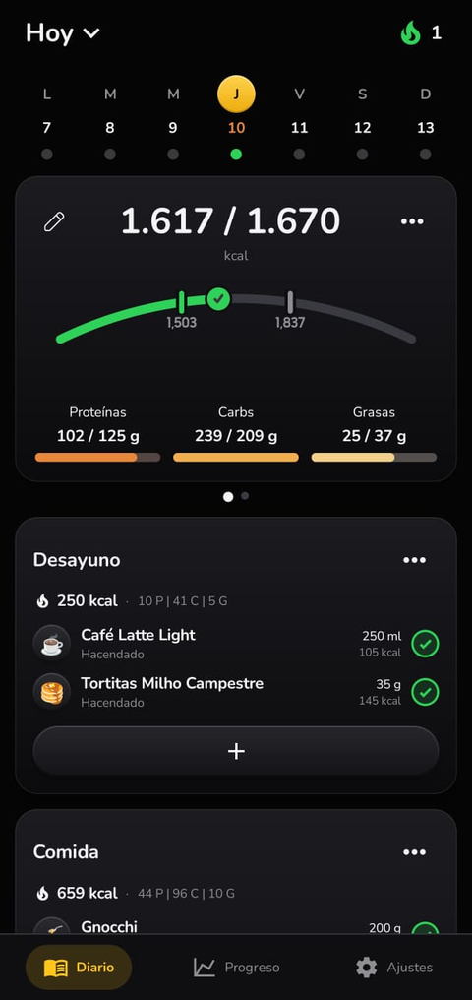
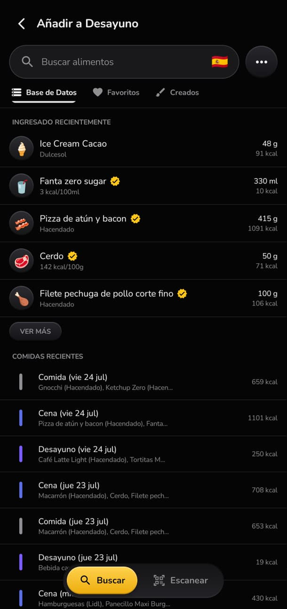
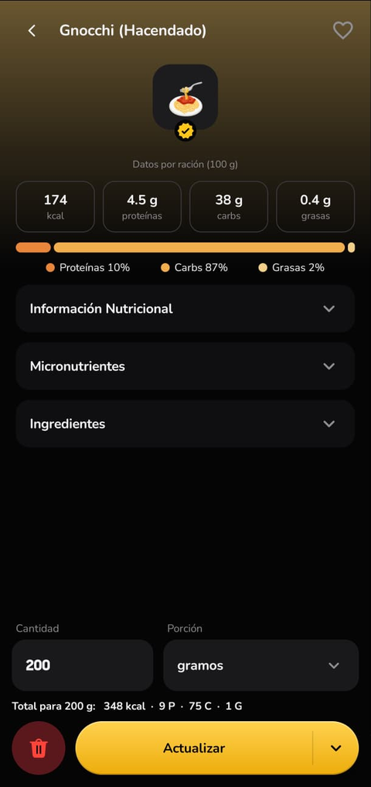
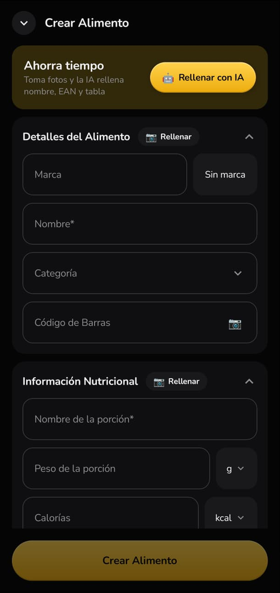

# MiNutrición

App Android de registro nutricional, nativa en Kotlin y Jetpack Compose. Se
apunta lo que se come, se escanea el código de barras de un producto y la ficha
sale de una base local que viaja con la app, antes de consultar nada por red.

| Diario | Añadir alimento | Ficha del producto | Crear alimento |
|---|---|---|---|
|  |  |  |  |

## Qué hace

- **Diario por días** con objetivo de calorías, reparto de macros y comidas
  configurables (nombre, orden y reparto calórico de cada una).
- **Escáner de códigos de barras** con CameraX y ML Kit. Resuelve primero contra
  la base local; solo si no está, va a Open Food Facts.
- **Rellenar desde una foto de la etiqueta**: reconocimiento de texto con ML Kit
  y, opcionalmente, Gemini para interpretar la tabla nutricional.
- **Progreso**: peso, rachas y detalle por macro.
- **Base de 10.291 alimentos** de supermercados y fabricantes españoles,
  empaquetada como asset y producida por el
  [scraper](https://github.com/Cerventus04/scraper-alimentos).

## Cómo llegó a ser nativa

Empezó como prototipo de escritorio en Python con CustomTkinter, para tener algo
usable rápido. Después vino un port a Kivy buscando llevarlo al móvil, y ahí se
vio el problema: la interfaz no daba el rendimiento necesario. Cambiar de día
repintaba toda la lista de comidas y se notaba.

La reescritura nativa arregló eso de raíz, y de paso permitió una decisión que en
Kivy no salía: **no se mutan las filas de comidas, se intercambian paneles ya
construidos**. Los días vecinos (±1 semana) se precargan, así que moverse por el
calendario no reconstruye nada.

## Detalles que costaron

- **Un perfil por sabor, varios códigos de barras por ficha.** Una proteína de
  chocolate y una de vainilla tienen nutrición distinta, así que son fichas
  distintas; pero el bote de 1 kg y el de 2 kg del mismo sabor comparten ficha y
  cada uno tiene su EAN. De ahí la columna `barcodes` además de `barcode`.
- **Bebidas.** Se detectan por la categoría de Open Food Facts más un registro
  propio, para mostrarlas en mililitros y con su icono. Por palabras genéricas,
  nunca por marca.
- **Tipografía.** Toda la app usa Nunito, registrada con `AddFontResourceExW` y
  fijada como familia por defecto del tema.

## Compilar

```bash
bash build.sh          # desde WSL: SDK de Android + Gradle 8.7
```

El script copia el fuente a un directorio de build persistente (para no perder la
caché de Gradle), genera `local.properties` con la ruta del SDK y compila el APK
de depuración.

`local.properties` no está en el repositorio: contiene la ruta del SDK y, si se
quiere usar el rellenado con IA, la clave de la API de Gemini.

```properties
sdk.dir=/ruta/al/android-sdk
gemini.api.key=tu_clave        # opcional
```

## Estructura

```
app/src/main/java/org/ivansola/minutricion/
  data/        base local, Open Food Facts, cálculo nutricional, Gemini
  ui/screens/  18 pantallas (diario, progreso, escáner, alimentos, ajustes…)
  ui/components/
  widget/      widget de pantalla de inicio
app/src/main/assets/nutricion.db    base de alimentos empaquetada
tools/         utilidades de prueba de los prompts de IA
```

**Stack**: Kotlin · Jetpack Compose (BOM 2024.09) · Material 3 · CameraX 1.3.4 ·
ML Kit (código de barras y reconocimiento de texto) · SQLite · minSdk 24.

---

Iván Sola Rodríguez · [ivsola04@gmail.com](mailto:ivsola04@gmail.com)
